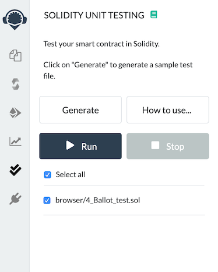
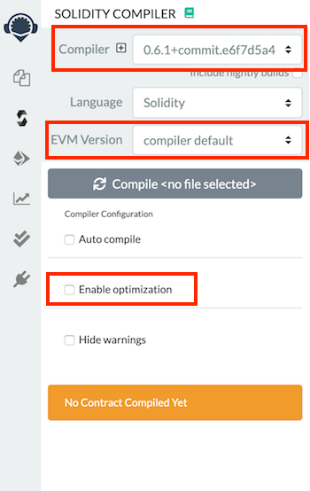

Unit Testing Plugin
============

Click the

 icon to get to the "Solidity Unit Testing" plugin. 
 
 If you haven't used this plugin before and are not seeing `double check` icon, you have to activate it from Remix plugin manager.
 
Go to the plugin manager (by click the  icon) and load up the unit testing plugin.


Now `double check` icon will appear on the left side icon bar. Clicking on icon will load the unit testing module in the side panel.



Generate Test File
------------------
Click the button `Generate test file` to create a new solidity file in the current folder suffixed with `_test`. This file contains the minimum you need for running unit testing.

Write Tests
-----------
Write tests to check the functionality of your contract. Remix injects a built-in `assert` library which can be used for testing. Visit the library documentation [here](./assert_library).

Apart from this, Remix allows usage of some special functions to make testing more structural. They are:

* `beforeEach()` - Runs before each test
* `beforeAll()` - Runs before all tests
* `afterEach()` - Runs after each test
* `afterAll()` - Runs after all tests

To get started, see [this simple example](./unittesting_examples.html#simple-example).

Run Tests
------------------

Click the button "Run tests" to executes all tests whose box has been checked below (by default all). The execution is run in a separate environment and the result is displayed below.


Customization
------------------
Remix facilitates users with various types of customizations to test a contract properly.

**1. Custom Compiler Context**

`Solidity Unit Testing` refers `Solidity Compiler` plugin for compiler configurations. One can provide customized inputs for `Compiler`, `EVM Version` & `Enable Optimization` and these will be the configuration settings used for contract compilation before running unit tests.



**2. Custom Transaction Context**

For a contract method interaction, prime parameters of transaction are `from` address, `value` & `gas`. Usually, we need to test a method's behaviour under different values of these parameters.

Remix provides the functionality of custom `msg.sender` & `msg.value` of transaction using method devdoc like:

```
/// #sender: account-0
/// #value: 10
function checkSenderIs0AndValueis10 () public payable {
    Assert.equal(msg.sender, TestsAccounts.getAccount(0), "wrong sender in checkSenderIs0AndValueis10");
    Assert.equal(msg.value, 10, "wrong value in checkSenderIs0AndValueis10");
}
```
Things to keep in mind while using custom transaction context:

1. Parameters must be defined in devdoc of related method
2. Each parameter key should be prefixed with a hash (**#**) and end with a colon following a space (**:&nbsp;**) like `#sender: ` & `#value: `
3. For now, customization is available for parameters `sender` & `value` only
4. Sender is `from` address of a transaction which is accessed using `msg.sender` inside a contract method. It should be defined in a fixed format as '**account-**<account_index>'
5. `<account_index>` varies from `0-2` before remix-ide release v0.10.0 and `0-9` afterwards
6. `remix_accounts.sol` must be imported in your test file to use custom `sender`
7. Value is `value` sent along with a transaction in `wei` which is accessed using `msg.value` inside a contract method. It should be a number.

Regarding `gas`, Remix estimates the required gas for each transaction internally. Still if a contract deployment fails with `Out-of-Gas` error, it tries to redeploy it by doubling the gas. Deployment failing with double gas will show error: ```contract deployment failed after trying twice: The contract code couldn't be stored, please check your gas limit```

Various test examples can be seen in [examples](./unittesting_examples) section.


Points to remember
------------------

* A test contract cannot have a method with parameters. Having one such method will show error: `Method 'methodname' can not have parameters inside a test contract`
* Number of test accounts are `3` before remix-ide release v0.10.0 and `10` afterwards
* A test file which imports `remix_accounts.sol` might not compile successfully with `Solidity Compiler` plugin but it will work fine with Solidity Unit Testing plugin.

Remix-tests
----------------------

`remix-tests` is the module which works underneath of remix-ide `Solidity Unit Testing` plugin. 

`remix-tests` is an [NPM package](https://www.npmjs.com/package/remix-tests). It can also be used as  a CLI/CI solution, supporting node.js. Find more information about this type of usage in the [remix-tests repository](https://github.com/ethereum/remix/tree/master/remix-tests#as-command-line-interface)

For CI implementation example, see [Su Squares contract](https://github.com/su-squares/ethereum-contract/tree/e542f37d4f8f6c7b07d90a6554424268384a4186) and [Travis build](https://travis-ci.org/su-squares/ethereum-contract/builds/446186067) that uses `remix-tests` for continuous integration testing.
